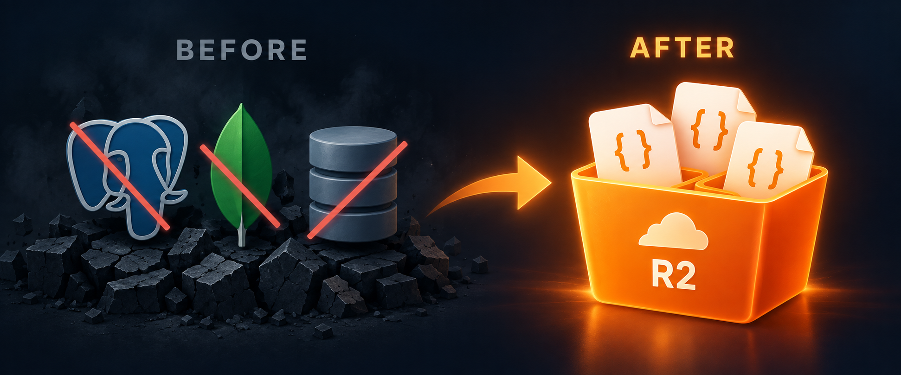

# dbless



`dbless` is a small TypeScript package for storing JSON documents directly in a private Cloudflare R2 bucket. Install it in each Node.js app you host on Vercel.

The same bucket can hold data for many apps. Each app chooses an `app` name and `environment`, which become part of every object key:

```text
data/v1/recipe-app/production/recipes/recipe_123.json
data/v1/portfolio/production/projects/project_456.json
```

## Install and connect

Until this package is published to npm, install it from this repository:

```sh
npm install github:martinzokov/dbless
```

Give each app these server-only environment variables:

```text
R2_ACCOUNT_ID=your-cloudflare-account-id
R2_BUCKET=your-private-bucket-name
R2_ACCESS_KEY_ID=your-r2-access-key-id
R2_SECRET_ACCESS_KEY=your-r2-secret-access-key
```

Create a Cloudflare R2 API token with Object Read & Write permission scoped to that bucket. Its S3 credentials are an access key ID and secret access key; R2's S3 API does not use a single bearer key. The bucket does not need public access. [Cloudflare R2 S3 API](https://developers.cloudflare.com/r2/api/s3/api/)

```ts
import { createStore } from "dbless";

interface Recipe { title: string; servings: number }

const store = createStore({
  accountId: process.env.R2_ACCOUNT_ID!,
  bucket: process.env.R2_BUCKET!,
  accessKeyId: process.env.R2_ACCESS_KEY_ID!,
  secretAccessKey: process.env.R2_SECRET_ACCESS_KEY!,
  app: "recipe-app",
  environment: process.env.VERCEL_ENV ?? "development",
});

const recipes = store.collection<Recipe>("recipes");
await recipes.create({
  id: "recipe_123",
  data: { title: "Tomato soup", servings: 4 },
});

const current = await recipes.get("recipe_123");
await recipes.patch("recipe_123", { servings: 6 }, { ifMatch: current.etag });
const page = await recipes.list({ limit: 50 });
await recipes.delete("recipe_123", { ifMatch: (await recipes.get("recipe_123")).etag });
```

Import and call the package only from server-side code, such as a Vercel Function or a Next.js Server Action. Never put R2 credentials in browser code or `NEXT_PUBLIC_` variables. Your application remains responsible for authenticating its users and checking which documents they may access.

## Document operations

| Method | Meaning |
| --- | --- |
| `create({ data, id? })` | Write a new JSON document; generates a UUID if `id` is omitted |
| `get(id)` | Read one document |
| `put(id, data, { ifMatch })` | Replace a document's data |
| `patch(id, patch, { ifMatch })` | Apply JSON Merge Patch to a document's data |
| `delete(id, { ifMatch })` | Conditionally write a tombstone |
| `list({ limit?, cursor?, prefix?, includeData? })` | List document summaries, optionally with data |

Documents have `id`, `revision`, `createdAt`, `updatedAt`, `data`, and `etag`. `put`, `patch`, and `delete` require the ETag from a previous read. If another writer has changed the file, the operation throws `StoreError` with `status === 412`. Creates use a conditional write and throw `409` for an existing ID. `patch` treats `null` as removal and replaces arrays as a whole.

`list` returns `{ documents, cursor }`. Continue passing the cursor until it is `null`. The default page size is 50 summaries or 20 documents with `includeData: true`; the maxima are 100 and 20. A page can contain fewer documents than requested when it includes tombstones. Listings are not snapshots.

The default document limit is 256 KiB including metadata; change it with `maxDocumentBytes`. Collection, app, and environment names use lowercase letters, digits, `_`, and `-`. Document IDs also permit uppercase letters. IDs cannot be reused after deletion because tombstones remain.

## Sharing one bucket

Use a different `app` name for each app and separate environments such as `production`, `preview`, and `development`. Those prefixes keep files organized and prevent accidental collisions. Cloudflare R2 tokens can be scoped to the bucket, but not to an object prefix, so any app holding a read/write credential for this bucket can also access other apps' files. Use a separate bucket when you need enforced access isolation.

This works best when you mostly address documents by ID. It does not provide field queries or multi-document transactions.

## Test the package

See the [direct R2 example](examples/direct-r2/README.md). With R2 settings in an ignored `.env` file, run:

```sh
npm install
npm run typecheck
npm test
npm run build
npm run smoke:r2
```

The smoke test writes to `data/v1/dbless-direct-test/local/smoke/` and leaves a tombstone after deleting the test document.
